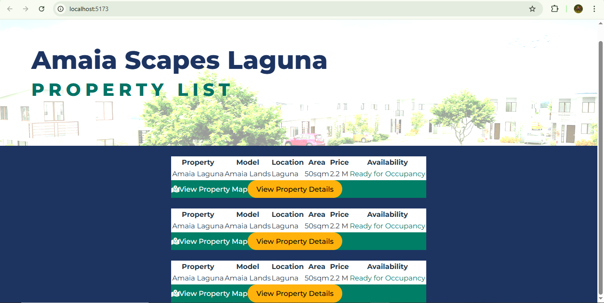

# Amaia Escapes React App – OJT Training

This project was created as part of the **OJT training** for building the **Amaia Escapes React App**.

It uses **React** and **Vite** to implement a fast and modern frontend with hot module replacement (HMR), making development quick and efficient.

---

## 🛠 Tech Stack

- **React** – Frontend library for building user interfaces.
- **Vite** – Next-generation frontend tooling for fast builds and instant reloads.
- **ESLint** – For code linting and formatting.
- **Babel or SWC** – Used via Vite plugins for fast refresh.

---

## 📦 Vite Plugins Used

You can choose from the following official Vite plugins:

- [`@vitejs/plugin-react`](https://github.com/vitejs/vite-plugin-react/blob/main/packages/plugin-react) – Uses Babel for Fast Refresh.
- [`@vitejs/plugin-react-swc`](https://github.com/vitejs/vite-plugin-react/blob/main/packages/plugin-react-swc) – Uses SWC for Fast Refresh.

---

## 🔍 ESLint Configuration

If you plan to grow this into a full production application, it’s recommended to use **TypeScript** and enable **type-aware lint rules**.

For more advanced setup:
- Check out the [React + TS template](https://github.com/vitejs/vite/tree/main/packages/create-vite/template-react-ts)
- Learn more about [`typescript-eslint`](https://typescript-eslint.io)

---

## 🚀 Getting Started

```bash
npm create vite@latest
npm install
npm run dev

---

## Version 1.0



A preview of the initial design is added. Still not responsive when zoomed in or out.
Purely a web design layout, no functionalities yet.
